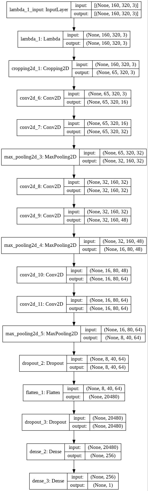

# **Behavioral Cloning** 

## Writeup Template

### You can use this file as a template for your writeup if you want to submit it as a markdown file, but feel free to use some other method and submit a pdf if you prefer.

---

**Behavioral Cloning Project**

The goals / steps of this project are the following:
* Use the simulator to collect data of good driving behavior
* Build, a convolution neural network in Keras that predicts steering angles from images
* Train and validate the model with a training and validation set
* Test that the model successfully drives around track one without leaving the road
* Summarize the results with a written report


[//]: # (Image References)

[image1]: ./examples/placeholder.png "Model Visualization"
[image2]: ./examples/placeholder.png "Grayscaling"
[image3]: ./examples/placeholder_small.png "Recovery Image"
[image4]: ./examples/placeholder_small.png "Recovery Image"
[image5]: ./examples/placeholder_small.png "Recovery Image"
[image6]: ./examples/placeholder_small.png "Normal Image"
[image7]: ./examples/placeholder_small.png "Flipped Image"

## Rubric Points
### Here I will consider the [rubric points](https://review.udacity.com/#!/rubrics/432/view) individually and describe how I addressed each point in my implementation.  

---
### Files Submitted & Code Quality

#### 1. Submission includes all required files and can be used to run the simulator in autonomous mode

My project includes the following files:
* model.py containing the script to create and train the model
* drive.py for driving the car in autonomous mode
* model.h5 containing a trained convolution neural network 
* README.md or writeup_report.pdf summarizing the results (you're reading that right now!)

#### 2. Submission includes functional code
Using the Udacity provided simulator and my drive.py file, the car can be driven autonomously around the track by executing 
```sh
python drive.py model.h5
```

#### 3. Submission code is usable and readable

The model.py file contains the code for training and saving the convolution neural network. The file shows the pipeline I used for training and validating the model, and it contains comments to explain how the code works.

### Model Architecture and Training Strategy

#### 1. An appropriate model architecture has been employed

My model uses a Convolutional Neural Network to successfully train an autonomous agent in the Udacity self driving car simulator.

Model pipeline:

- Convolution, kernel size of 5x5, padding='same', input depth = 3 (RGB), output = 16
- ReLU actvation (did some research and found out that this activation function helps convolutions really well)
- Convolution, kernel size of 5x5, padding='same', input depth = 16, output = 32
- ReLU
- Maxpooling, kernel size of 2x2

- Convolution, kernel size of 5x5, padding='same', input depth = 32, output = 32
- ReLU actvation (did some research and found out that this activation function helps convolutions really well)
- Convolution, kernel size of 5x5, padding='same', input depth = 32, output = 48
- ReLU
- Maxpooling, kernel size of 2x2

- Convolution, kernel size of 5x5, padding='same', input depth = 48, output = 64
- ReLU actvation (did some research and found out that this activation function helps convolutions really well)
- Convolution, kernel size of 5x5, padding='same', input depth = 64, output = 64
- ReLU
- Maxpooling, kernel size of 2x2
- Dropout with probability of 0.3

- Model Flattening
- Dropout of 0.9
- Dense unit of 256
- Dense unit of 64
- Output dense layer of 1

- Compiled the model with mse loss and Adam optimizer (learning rate = 1e-3)
- Trained on batch_size of 32 for 5 epochs
#### 2. Attempts to reduce overfitting in the model

Used dropout layers to reduce overfitting (lines 47 and 50). I found that many successful models have dropout right after flattening the model because it helps combat an exploding/vanishing gradient where a few gradients dominate the entire decision making process.

I was also thinking about putting dropouts after convolutions since a lot of state-of-the art models use this. The reason why I did not do this though was mainly because I started noticing that I was losing information/features because these nodes are being reset as the model trains. Instead, I let the model learn and add features and if the model overfits and has a high gradient, then the dropout at the end resets the nodes.

#### 3. Model parameter tuning

The model used an adam optimizer, so the learning rate was not tuned manually (model.py line 25). Instead, the default learning rate was used (in this case, 1e-3).

I also used the MSE loss to train the model.

#### 4. Appropriate training data

Training data was chosen to keep the vehicle driving on the road. I decided to keep the data as it is and not use the left, right, and center images to help train the model as I did that and instead of generalizing the model, it made it do even worse. I assume this is mainly becuase the camera is always in the center of the car and not on either side so training for that would be useless.

Instead, I actually flipped the image horizontally so that it would look like I was driving backwards. This would give a better generalization of the model and allow it to train better on the track.

I converted the images to RGB as well and normalized them by dividing by 255.0 as it would allow for a range of pixels to be between 0 and 1 vs a bigger range of 0-255.

### Model Architecture and Training Strategy

#### 1. Solution Design Approach

I decided to use 2 convolutional layers followed by a maxpool and repeated that 3 times as the main approach for the model. This is mainly from experimenting and noticing that it seemed to work better vs. having a single layer.

ReLU works with convolutions which is why I was using it.

I also decided to cap the # of filters at 64 mainly because I thought 128 would be too many filters. That's why I started with 16, then 32 (did this twice so that the model can catch on new features that it might've missed), then 48, then 64 twice for the same reason as 32.

Form research, I also found that having a dense layer that's a big value (like 256 for example) and then having a small one (in this case, 64, then 1) is generally a good way to get good predictions. Having too many dense layers can allow for unecessary parameters that might not even work.

#### 2. Final Model Architecture

Take a look at the visualization below:



#### 3. Creation of the Training Set & Training Process

I had actually chosen to use the existing and provided data to train the model. Mainly because of "garbage in, garbage out". I wanted to create a good model that can actually work with the simulator. 

The data files had a lot of data and were very well done which is why I had decided to stick with them

To augment the data sat, I also flipped images and angles because it would allow for a better generalization of the model.

Here's an example. Pay close attention to the trees...


I used a validation split of 0.2 when training the model in `model.fit` so that the model can learn from validation data and make it a state of the art convolutional neural network.

Take a look at the video [here](run1.mp4)